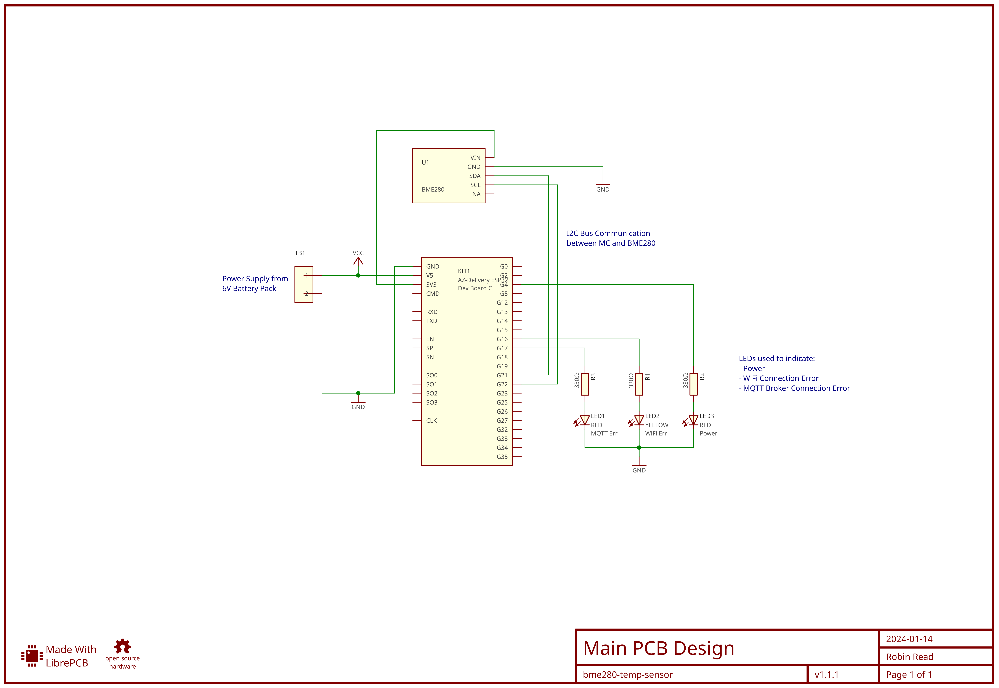

# BEM280/ESP32 Home IoT Temperature Sensor PCB Design

This is a [LibrePCB](https://librepcb.org) project! It is the PCB design for IoT sensor
based on a [Pimoroni BME280](https://shop.pimoroni.com/products/bme280-breakout?variant=29420960677971) and a [AZ-Delivery ESP32 Development Board C](https://www.az-delivery.uk/products/esp32-developmentboard).

It represents the PCB for the accompanying [MQTT Based BME280 & ESP32 IOT Sensor software](https://github.com/robingread/esp32-bme280-mqtt-iot-sensor), which is another one of my GitHub projects.

The latest Schematic and PCB design are shown below:

## Bill of Materials

| Component | Item |
|--|--|
| `KIT1` | AZ-Delivery ESP32 Development Board C |
| `LED1` | 5mm, 6V LED, Red |
| `LED2` | 5mm, 6V LED, Red |
| `LED3` | 5mm, 6V LED, Yellow |
| `R1` | 330 Ohm Resistor
| `R2` | 330 Ohm Resistor
| `R3` | 330 Ohm Resistor
| `TB1` | 2 pin, single row terminal block with 2.54 mm pitch |
| `U1` | Pimoroni BME280 I2C Sensor |
